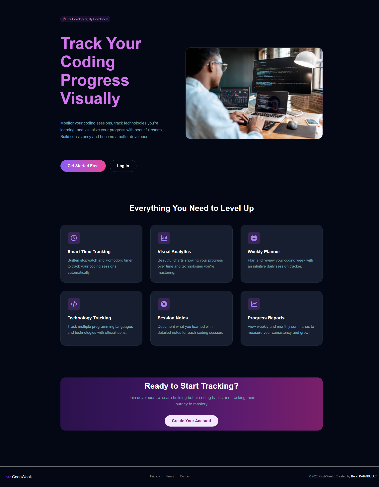
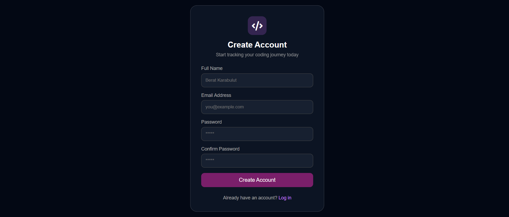
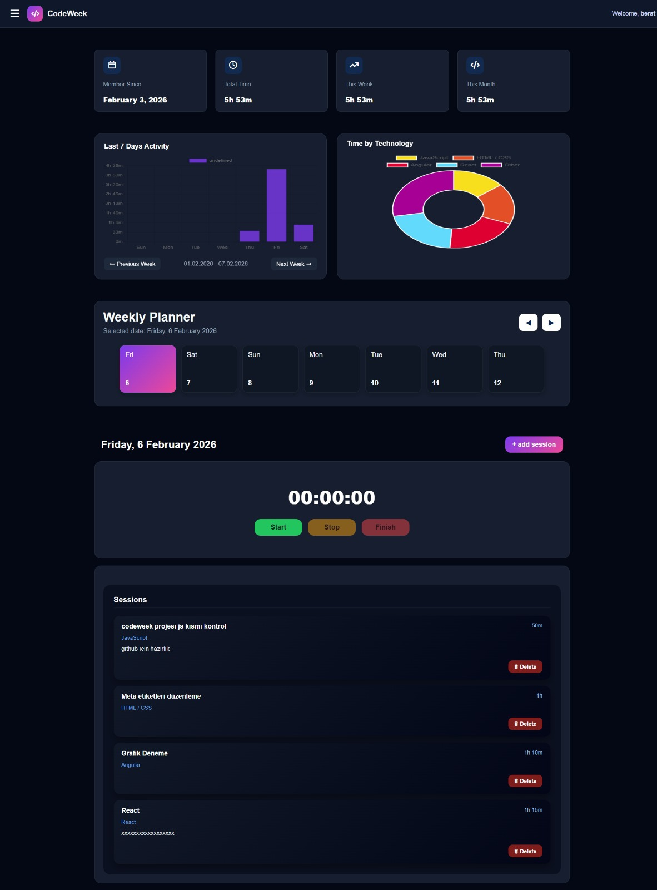
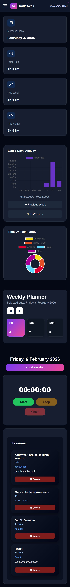

# 🚀 Codeweek

**Codeweek** is a visual coding progress tracker built with **Vanilla JavaScript**, designed to help developers track their coding activity, analyze progress, and build consistent development habits over time.

This project was developed primarily as a **portfolio project** and continues to evolve with new features and improvements. The long-term goal is to deploy it as a live, production-ready application.

---

## 🎯 Project Purpose

Codeweek was created to better understand my own coding workflow while strengthening my frontend development skills using pure JavaScript without frameworks.

The project aims to:

* ⏱️ Track daily and weekly coding sessions
* 📊 Visualize progress with meaningful charts and statistics
* 🧠 Encourage consistency and sustainable coding habits
* 🧪 Practice real-world frontend logic (state, data flow, user interaction)

---

## 🧩 Core Features

* 👤 **User Authentication (Register & Login)**
  Users can create an account and log in to access their own personalized coding data.

* ⏱️ **Smart Time Tracking**
  Track coding sessions using a built-in timer with session-based records.

* 🗓️ **Weekly & Daily Overview**
  View coding activity on a weekly basis, with the ability to navigate between previous and upcoming weeks.

* 📊 **Visual Analytics**
  Analyze progress using charts that display time distribution and activity trends.

* 🧩 **Technology Tracking**
  Track how much time is spent on different programming languages and tools.

* 📝 **Session Notes**
  Add notes to each session to document what was learned or worked on.

---

## 🛠️ Technologies & Tools

* **HTML5** – Semantic and accessible structure
* **CSS3** – Modern, responsive UI design
* **Vanilla JavaScript** – Core application logic
* **JSON Server** – Mock backend & user data handling
* **Chart.js** – Data visualization
* **Font Awesome** – Icons
* **Custom Logo & UI Design**

---

## 📂 Project Structure

* `public/` – Frontend files (HTML, CSS, JS)
* `db.json` – Mock database for users and sessions
* `assets/` – Images, icons, and UI resources

---

## ▶️ How to Run the Project

Follow the steps below to run the project locally.

### 1️⃣ Open the Project Files

* Open the project from the **`public`** directory

---

### 2️⃣ Start Live Server

* Open **`index.html`** using **Live Server**
* The application will automatically open in the browser

---

### 3️⃣ Start JSON Server

* Make sure `db.json` is located in the root directory
* Run the following command:

```bash
json-server --watch db.json --port 3000
```

---

## 🎥 Preview






